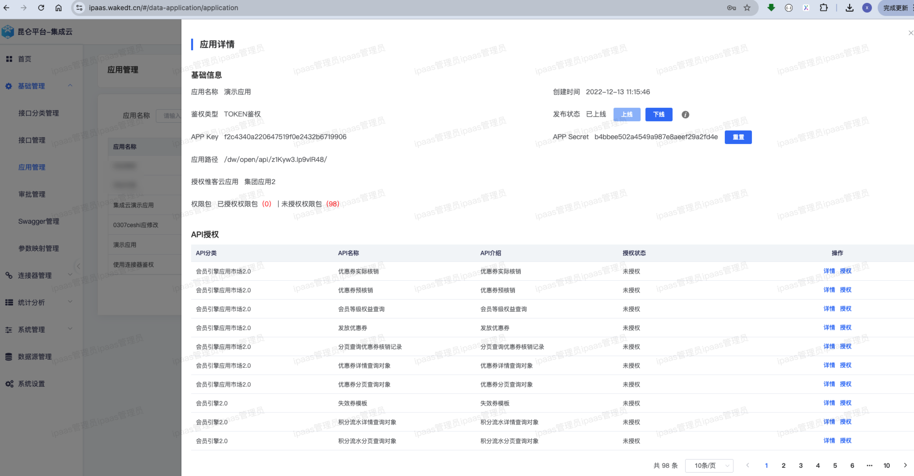

  <a href="/README.md">English</a>
  | 
  <a href="/readme/readme-jp.md">日本語</a>
  | 
  <a href="/readme/readme-zh-cn.md">简体中文</a>
  | 
  <a href="/readme/readme-zh-tw.md">繁體中文</a>

<b>昆仑-集成云iPaaS是开源的一站式API网关，帮助开发者和企业轻松管理、集成和部署API服务。昆仑集成云 基于 Apache 2.0 协议开源，这意味着它可以免费商用！</b>

 

✨ 通过标准化、可视化提升集成效率50%

 

# 💌 我们为什么打造 昆仑-集成云
昆仑-集成云起源于惟客数据中台的数据服务，可以把数据表、内部API、webservice等服务，发布成标准的RESTFul API，并自动生成API接口文档，此外，昆仑-集成云还有很多其他特性等你来发掘！

 

# ✨ 快速开始

## Docker部署

### 前端部署

### 后端部署

# 🔥 特性
<table>
  <tr>
    <th>
      统一API管理
    </th>
    <th>
      流程编排
    </th>

  </tr>

  <tr>
    <td width="50%">
        
    </td>
    <td width="50%">
        
    </td>
  </tr>

  <tr>
    <th>
      应用授权
    </th>
    <th>
     Swagger一键导入
    </th>

  </tr>

  <tr>
    <td width="50%">
        
    </td>
    <td width="50%">
        
    </td>
  </tr>

  <tr>
    <th>
      连接器接口管理
    </th>
    <th>
      API可观测
    </th>

  </tr>

  <tr>
    <td width="50%">
        
    </td>
    <td width="50%">
        
    </td>
  </tr>
  
</table>

 

# 🚀 适用场景
## 统一API门户，API资产化
  - API生命周期管理，统一管理API，API上线、下线、授权、测试一体化平台。
  - 标准API管理，形成企业内API门户资产。
  - 细化接口访问控制，支持接口级权限管理。

## 快速响应业务需求，构建企业所需能力
  - 可视化的流程编排，快速开发与对接。
  - 跨系统数据流、业务流整合

## 多租户管理和灵活订阅
  - 支持多租户、多应用管理，满足不同业务单元需求。
  - 灵活的订阅和审核流程简化 API 的使用和管理。

## API 可观测性
  - 实时监控和追踪 API 使用情况。
  - 支持API使用日志监控与流控。

 

# 💌联系我们
对于企业级功能和专业技术支持，请联系售前专家进行个性化演示、定制方案和获取报价。

- 网站: https://wakedata.com/wake-integrated.html
- 电子邮件: x@wakedata.com

 

🙏 我们衷心感谢每一位为昆仑-集成云贡献力量的人，你们的意见和建议对我们至关重要！让我们携手并进，共同打造一个更加强大且充满乐趣的API世界。🎉

